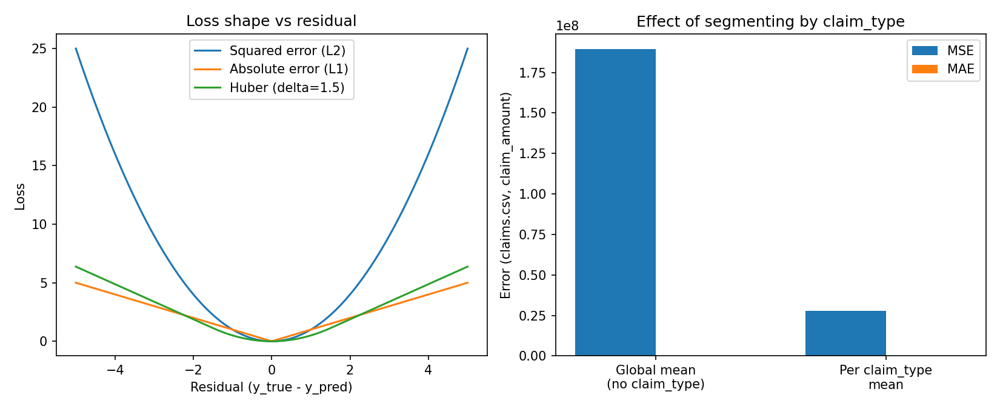
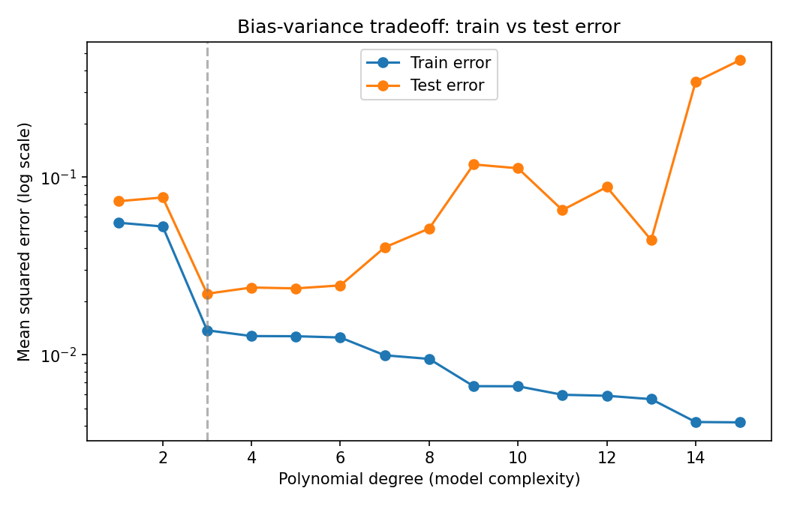
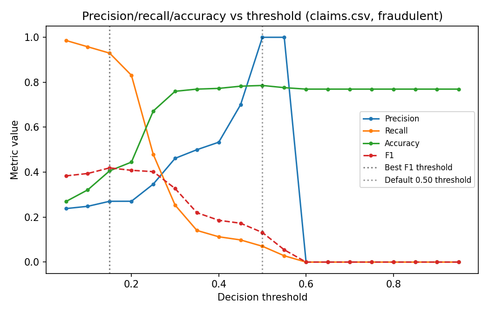

# Trouver le meilleur modèle d'apprentissage automatique pour une tâche

## Quelques fondations théoriques de l'apprentissage automatique

### Objectif 

L'objectif de l'*apprentissage automatique* est de construire une fonction qui crée des règles entre une entrée et une sortie à partir d'exemples. 

### Concentrons-nous sur l'apprentissage supervisé

Pour les besoins de ce cours, nous nous concentrerons sur l'apprentissage supervisé. L'**objectif de l'apprentissage supervisé est de prédire le label $Y$ associé à chaque nouvelle observation $X$** (où nous supposons que $Z=(X,Y)\overset{i.i.d}{\sim} \mathbb{P}$ est une nouvelle observation de la loi $\mathbb{P}$).

### Vocabulaire et notations

- Une **feature** (ou variable d'entrée), notée $V_i$, est une propriété mesurable qui décrit l'état d'un système. Par exemple, pour la prédiction d'attrition client, elle pourrait représenter l'activité récente du client ou le nombre de produits achetés. Les features forment les « colonnes » de notre ensemble de données.
- Le **label** (ou étiquette) $Y_i$ est la variable de sortie que nous voulons prédire. C'est une colonne unique de notre ensemble de données. 
- Une **observation** est un couple $Z_i=(X_i, Y_i)$ d'une instance et d'un label. Nous supposons que les $Z_i$ suivent indépendamment et identiquement la même loi de distribution inconnue $\mathbb{P}$ (noté $Z_i \overset{i.i.d}{\sim} \mathbb{P}$). Généralement, $X_i \in \mathcal{X}=\mathbb{R}^p$ et $Y_i \in \mathcal{Y}$ qui est un sous-ensemble fini de $\mathbb{N}$ (pour la classification) ou un sous-ensemble de $\mathbb{R}$ (pour la régression).
- Une **instance** $X_i=(X_{i,1}, ...X_{i,p})$ est une réalisation des variables aléatoires de toutes les features considérées (c.-à-d. chaque marge $X_{i,k}\overset{i.i.d}{\sim}V_k$). C'est un exemple observé des features. Les instances sont les « lignes » de notre ensemble de données.
- L'ensemble de données $(Z_1, ..., Z_n)$ s'appelle l'**ensemble d'entraînement**.  
- Une **fonction de prédiction** est une fonction (mesurable) de $\mathcal{X}$ dans $\mathcal{Y}$. L'ensemble des fonctions de prédiction s'appelle $\mathcal{F}(\mathcal{X}, \mathcal{Y})$. 
- Un **algorithme d'apprentissage automatique** est une fonction qui mappe un ensemble d'entraînement à une fonction de prédiction. Formellement : $\underset{n\in \mathbb{N}}{\cup}(\mathcal{X} \times \mathcal{Y})^n \to \mathcal{F}(\mathcal{X}, \mathcal{Y})$. 
- Une **loss** (ou fonction de perte) $l:\mathcal{Y} \times \mathcal{Y} \to \mathbb{R}$ représente le « coût » quand la valeur réelle est $y$ et la valeur prédite est $y'$. Pour la classification, une loss courante est $l(y,y')=\mathbb{1}_{y\neq y'}$ ; pour la régression, nous utilisons souvent $l(y,y')= \lvert y-y' \rvert^p $ qui s'appelle régression $L^p$ (avec p=2 c'est la régression des moindres carrés ordinaire).

### L'apprentissage automatique comme problème d'optimisation générale

La qualité d'une fonction de prédiction $g: \mathcal{X} \to \mathcal{Y}$ est mesurée par son « risque » (erreur de généralisation) : $\mathcal{R}_{\mathbb{P}}(g)= \mathbb{E}_\mathbb{P}[l(Y, g(X))]$.

La (en fait, « une ») « meilleure » fonction de prédiction est celle qui minimise la perte moyenne par rapport à la loi $\mathbb{P}$. Donc, avec toutes les notations précédentes, les problèmes d'apprentissage automatique peuvent être réécrits comme la recherche d'un optimum $g_\mathbb{P}^*$ :

$$
g_\mathbb{P}^* \in \underset{g \in \mathcal{F}(\mathcal{X}, \mathcal{Y})}{\argmin}{\space \mathbb{E}_\mathbb{P}[l(Y, g(X))]}
$$

$g_\mathbb{P}^*$ s'appelle une **fonction oracle** ou un **prédicteur de Bayes**. 

### Un ensemble spécifique de solutions pour la perte L^p et de classification

Notez qu'il n'y a aucune garantie que $g_\mathbb{P}^*$ existe toujours, mais c'est le cas pour les fonctions de perte précédemment introduites. 

> [!TIP]
> Intuitivement, avant le formalisme : si vous aviez des données infinies, quel est le meilleur nombre unique à prédire pour un groupe de risques similaires ? Pour l'erreur quadratique, c'est simplement la *moyenne* de l'issue dans ce groupe (par exemple, la sévérité moyenne pour une cellule de tarification donnée). Pour la classification, c'est la *classe la plus fréquente* dans ce groupe (par exemple, « la plupart des sinistres dans ce segment ne sont pas frauduleux »). Le théorème ci-dessous rend cela précis et montre que cela s'applique à tout $x$, pas seulement « en moyenne ».

**Théorème** : Nous supposons que $X \sim P_X$ et nous notons la distribution de probabilité conditionnelle de Y donné x par $P_{Y|X}$. Alors une fonction qui minimize l'espérance conditionnelle pour tout x est une fonction oracle, c'est-à-dire : 

$$
\forall x \in \mathcal{X}, g_\mathbb{P}^*(x) \in  \underset{y \in  \mathcal{Y}}{\argmin}{\space \mathbb{E}_\mathbb{P}[l(Y, y)|X=x]} \Rightarrow g_\mathbb{P}^* \in \underset{g \in \mathcal{F}(\mathcal{X}, \mathcal{Y})}{\argmin}{\space \mathbb{E}_\mathbb{P}[l(Y, g(X))]}
$$

**Interprétation** : Ce théorème dit simplement que si vous faites le meilleur choix localement *pour chaque valeur x* (minimiser la perte moyenne pour ce profil spécifique), alors ce choix local est aussi optimal globalement (minimiser la perte moyenne sur toute la population). Autrement dit : construire l'oracle consiste à mettre en place une stratégie optimale *point par point*.

Concrètement, nous pouvons dériver les fonctions oracle pour plusieurs problèmes : 
- Pour la régression des moindres carrés, $\eta_{\mathbb{P}}^{*}(x)=\mathbb{E}_\mathbb{P}[Y|X=x]= \int_{\mathcal{Y}}y d\mathbb{P}_{Y|X}(y|x)$ est une fonction oracle
- Pour la classification, $g_\mathbb{P}^*(x) \in \underset{y \in \mathcal{Y}}{\argmax}{\space \mathbb{P}(Y=y|X=x)}$ est une fonction oracle
- Pour la classification binaire, $\mathcal{Y}=\{0,1\}$ et la fonction $x \mapsto \mathbb{1}_{\{\eta_{\mathbb{P}}^{*}(x)>1/2\}}$ est une fonction oracle

### Choisir une fonction de perte en pratique

Le théorème ci-dessus vous indique quelle fonction oracle *est* pour une perte donnée, mais pas *quelle perte choisir* pour un problème métier donné — et ce choix a plus d'importance que la plupart des autres décisions de modélisation.

> [!CAUTION]
> Choisir une perte suppose implicitement une distribution pour $Y|X$. Si cette hypothèse est fausse, votre modèle sera systématiquement biaisé même avec des données infinies et un optimiseur parfait — aucune quantité de réglage n'arrange un appariement de perte mal choisi.

| Perte | Hypothèse implicite sur $Y$ | Cas d'usage actuariel typique | Pourquoi |
|---|---|---|---|
| Erreur quadratique (L2) | Symétrique, bruit à variance à peu près constante (type Gaussien) | Rarement idéale seule pour les données de sinistres | Pénalise les grandes erreurs de manière quadratique — une poignée de sinistres extrêmes peut dominer l'ajustement |
| Erreur absolue (L1) / Huber | Bruit avec queue lourde ou sujet aux valeurs aberrantes | Régression robuste, réserves percentiles | Croît linéairement avec l'erreur au lieu de quadratiquement, donc les valeurs extrêmes comptent moins |
| Déviance de Poisson | Comptages non-négatifs, variance $\propto$ moyenne | **Fréquence** de sinistres (nombre de sinistres) | Respecte qu'un compte ne peut pas être négatif et que les segments à haute fréquence sont naturellement plus bruyants ; nécessite un **décalage d'exposition** (voir ci-dessous) |
| Déviance Gamma | Strictement positif, asymétrique à droite, variance $\propto$ moyenne$^2$ | **Sévérité** de sinistres (coût moyen par sinistre) | Correspond beaucoup mieux à la forme des données de sévérité que l'erreur quadratique |
| Déviance Tweedie | Masse au zéro + queue continue positive | **Prime pure** (fréquence $\times$ sévérité) en un seul modèle | Évite de former deux modèles distincts quand la masse zéro-sinistre est importante |
| Perte logarithmique / entropie croisée | Probabilités bien calibrées | Détection de fraude, classification d'attrition/churn | Convexe et différentiable (contrairement à la perte 0-1), et elle pénalise les prédictions confidentes et fausses plus qu'une prédiction hésitante et fausse |
| Perte 0-1 | — | Métrique d'évaluation finale uniquement (par exemple, précision) | Non différentiable, donc elle ne peut pas être utilisée pour *entraîner* un modèle — seulement pour *évaluer* un modèle déjà entraîné avec une perte substitut plus lisse |

Concrètement : si vous modélisez la **fréquence de sinistres**, utilisez une déviance de Poisson, pas l'erreur quadratique — voir « Exposition et décalages » juste ci-dessous. Si vous modélisez la **sévérité de sinistres**, une déviance Gamma (ou, plus simplement, la minimisation d'une cible transformée en log) tracera le vrai coût beaucoup mieux que l'erreur quadratique, précisément parce que les données de sévérité sont asymétriques à droite : une moyenne globale est tirée par quelques sinistres très importants, tandis qu'une perte qui respecte l'asymétrie ne l'est pas. Si vous avez besoin d'un **modèle de prime pure unique**, la déviance Tweedie vous permet de sauter la division fréquence/sévérité. Pour la **classification de fraude ou attrition**, entraînez le modèle avec la perte logarithmique (ou un substitut convexe équivalent) même si le métier se soucie finalement d'une décision 0-1 — vous choisirez ensuite le seuil de décision séparément (voir « Redéfinir le problème » ci-dessous).

La figure ci-dessous montre pourquoi le choix de perte compte concrètement, en utilisant l'ensemble de données `claims.csv` utilisé plus tard dans l'exemple travaillé de ce document : l'erreur quadratique et l'erreur absolue sont toutes deux calculées pour (a) une prédiction unique de sévérité moyenne globale, et (b) une moyenne par `claim_type`. Segmenter par `claim_type` seul réduit l'erreur quadratique moyenne d'environ 85% et l'erreur absolue moyenne d'environ 74% — non parce que le modèle est devenu plus intelligent, mais parce que la perte est finalement évaluée par rapport à une prédiction qui respecte la forme des données.

### Exposition et décalages dans la modélisation de fréquence

Supposez que vous voulez modéliser combien de sinistres une police va déclarer (un modèle de fréquence de type Poisson). Deux polices avec les mêmes features mais des **durées** très différentes — une assurée pendant un an complet, une assurée pendant un mois avant de changer d'assureur — ne sont pas comparables si vous regardez simplement leurs comptages de sinistres bruts : la police annuelle a douze fois plus d'opportunités de déclarer un sinistre. Le comptage brut n'est pas la quantité que vous voulez vraiment modéliser ; le **taux de sinistres par unité d'exposition** l'est.

C'est pourquoi les GLM de fréquence utilisent $\log(\text{exposition})$ comme **décalage** : au lieu de modéliser $\mathbb{E}[\text{nombre}|X]$ directement, le modèle prédit effectivement $\log(\text{taux}) = \eta(X)$ et y ajoute $\log(\text{exposition})$ avant de comparer à la nombre observée, donc que $\mathbb{E}[\text{nombre}|X, \text{exposition}] = \text{exposition} \times e^{\eta(X)}$. Deux polices ayant des features identiques mais des durées différentes obtiennent alors le même *taux*, mis à l'échelle par leur propre exposition — ce qui est exactement la comparaison que vous voulez.

> [!TIP]
> Chaque fois que vous modélisez des comptages (sinistres, appels, visites) sur des unités avec des fenêtres d'observation différentes, vérifiez si vous avez besoin d'un décalage d'exposition avant de vous tourner vers un modèle plus sophistiqué — c'est généralement le correctif d'effet de levier le plus élevé, et beaucoup plus simple que de changer d'algorithme.

Ceci se rattache directement à l'avertissement sur le rééchantillonnage plus tôt dans ce document : le rééchantillonnage éloigne $\mathbb{E}[Y_{\text{rééchantillonné}}|X]$ de la vraie $\mathbb{E}[Y|X]$, ce qui casse silencieusement l'estimation de probabilité/taux. Les décalages d'exposition sont la façon standard et fondée en principes dont les actuaires gardent les taux de fréquence comparables entre polices *sans* recourir au rééchantillonnage — ils corrigent une différence connue et mesurable (durée) plutôt qu'une différence artificielle introduite par le rééquilibrage de l'ensemble de données.

## Calculer les fonctions oracle

### Estimer le risque avec l'équivalent empirique

Rappelons que notre objectif est de trouver une fonction $g: \mathcal{X} \to \mathcal{Y}$ qui minimise le risque $\mathcal{R}_\mathbb{P}(g)= \mathbb{E}_\mathbb{P}[l(Y, g(X))]$. Étant donné que la distribution $\mathbb{P}$ est inconnue, le risque $\mathcal{R}_{\mathbb{P}}(g)$ et la fonction oracle sont inconnus. 

À des fins de calcul, nous remplacerons $\mathcal{R}_{\mathbb{P}}(g)$ par son homologue empirique :

$$
\hat{\mathcal{R}}_{n}(g)= \frac{1}{n} \sum_{i=1}^{n}l(Y_i, g(X_i))
$$

Grâce au théorème central limite (sous certaines hypothèses), nous avons :

$$
\hat{\mathcal{R}}_{n}(g) \overset{a.s}{\underset{n \to \infty}{\rightarrow}} \mathcal{R}_{\mathbb{P}}(g)
$$
et 
$$
\sqrt{n}(\hat{\mathcal{R}}_{n}(g) -\mathcal{R}_{\mathbb{P}}(g)) \overset{\mathcal{L}}{\underset{n \to \infty}{\rightarrow}} \mathcal{N}(0, \mathbb{V}[l(Y,g(X))])
$$

ce qui signifie que notre risque empirique $\hat{\mathcal{R}}_{n}(g)$ est asymptotiquement $\mathcal{O}(1/\sqrt{n})$ loin de sa moyenne $\mathcal{R}_{\mathbb{P}}(g)$. 

Afin de minimiser le risque, nous pouvons minimiser l'homologue empirique ce qui est une « bonne » approximation et il est intuitif de considérer l'algorithme d'apprentissage automatique : 

$$\hat{g}_{n, \mathcal{G}}=\underset{g \in\mathcal{G}}{\argmin}\space \hat{\mathcal{R}}_{n}(g)$$

où $\mathcal{G}$ est un sous-ensemble de $\mathcal{F}(\mathcal{X}, \mathcal{Y})$. 

Nous pouvons décomposer le risque en deux parties (positives !) : 

$$
\mathcal{R}_{\mathbb{P}}(\hat{g}_{n, \mathcal{G}})-\mathcal{R}_{\mathbb{P}}(g_{\mathbb{P}}^*)=\underbrace{\mathcal{R}_{\mathbb{P}}(\hat{g}_{n, \mathcal{G}})-\mathcal{R}_{\mathbb{P}}(\hat{g}_{\mathbb{P}, \mathcal{G}}^*)}_{\text{erreur stochastique}\simeq \text{variance}}+\underbrace{\mathcal{R}_{\mathbb{P}}(\hat{g}_{\mathbb{P}, \mathcal{G}}^*)-\mathcal{R}_{\mathbb{P}}(g_{\mathbb{P}}^*)}_{\text{erreur d'approximation}\simeq \text{biais}}
$$

Ceci s'appelle le **dilemme biais-variance**. 

> [!NOTE]
> Le **biais** est une *erreur systématique* — votre modèle est systématiquement inexact dans la même direction parce que $\mathcal{G}$ est trop restrictif pour capturer le vrai motif (par exemple, ajuster une ligne droite à une relation courbe). La **variance** est l'*instabilité* — réentraînez sur un échantillon légèrement différent et vous obtenez un modèle notablement différent, parce que $\mathcal{G}$ est assez flexible pour poursuivre le bruit dans cet exemple particulier.

Il faut trouver un équilibre : contrairement aux apparences, nous ne voulons PAS que $\mathcal{G}=\mathcal{F}(\mathcal{X}, \mathcal{Y})$ car il existe un nombre infini de « mauvaises » fonctions qui minimisent le risque empirique (par exemple, une fonction qui associe exactement chaque $x_i$ à $y_i$ et zéro ailleurs), ce qui conduit à un **surajustement**. En pratique, nous voulons que $\mathcal{G}$ soit « assez grand » pour que nous soyons capables d'approximer n'importe quelle fonction, et « assez petit » pour éviter les problèmes de généralisation et garder la fonction « lisse ».

La figure ci-dessous rend cela concret sur un problème de régression jouet : à mesure que la complexité du modèle (ici, le degré du polynôme) augmente, l'erreur d'entraînement continue de diminuer mais l'erreur de test finit par remonter — ce point de basculement est celui où la variance commence à dominer le biais.

## Conséquences appliquées lors de l'entraînement d'un modèle d'apprentissage automatique

Rappel : nous voulons résoudre le problème d'optimisation

$$
\underset{g \in\mathcal{G}}{\argmin}\space \frac{1}{n} \sum_{i=1}^{n}l(Y_i, g(X_i))
$$

Supposez que nous ayons déjà calculé un estimateur. Qu'est-ce que nous pouvons modifier pour en obtenir un meilleur ? 

### Qu'est-ce que nous pouvons optimiser ?

#### Réduire la variance : Optimiser la recherche « à l'intérieur » de $\mathcal{G}$

Il y a plusieurs possibilités que nous explorerons dans le reste de ce cours, notamment : 
1. **Changer la méthode d'optimiseur** pour accélérer la convergence / la rendre plus précise, en tenant compte de la fonction de perte. Par exemple, LBFGS (une méthode quasi-Newton) converge généralement plus rapidement et plus précisément que la descente de gradient simple pour les pertes lisses et convexes comme celles des GLMs, car elle utilise l'information de courbure au lieu d'un simple taux d'apprentissage — utile quand vous remarquez que les coefficients du modèle linéaire sont instables ou convergent lentement. Pour les pertes non-convexes (par exemple, les réseaux de neurones profonds), les variantes de la descente de gradient stochastique (Adam, etc.) sont préférées car l'information du second ordre est trop coûteuse à calculer à cette échelle.
- **Changer la loss** $l$ en une fonction « plus régulière » ou « plus convexe » (par exemple, logit / softmax au lieu du taux d'erreur) pour faciliter la convergence. Voir « Choisir une fonction de perte en pratique » ci-dessus pour *quelle* loss choisir et *pourquoi* — la version courte est que la loss devrait correspondre à la distribution supposée de $Y|X$ (Gamma pour la sévérité, Poisson pour la fréquence, perte logarithmique pour la classification), pas simplement être choisie pour la commodité numérique.
3. **Reformater les features** pour aider à la convergence : par exemple, discrétiser les features continues peut aider en réduisant l'espace $\mathcal{X}$  
4. **Ajouter une régularisation d'hyperparamètre** (par exemple, l1 - régression lasso, l2 - régression ridge) pour « lisser » l'espace $\mathcal{G}$. **L1 (lasso)** pousse certains coefficients exactement à zéro, ce qui est précieux quand vous voulez un ensemble *clairsemé, interprétable* de variables de tarification (moins de coefficients à justifier à un régulateur ou à un comité de tarification). **L2 (ridge)** rétrécit tous les coefficients vers zéro sans en éliminer aucun, ce qui est préférable quand les features sont corrélées (par exemple, plusieurs variables géographiques étroitement liées) car cela répartit l'effet entre elles au lieu de choisir arbitrairement l'une et de mettre les autres à zéro — cela rend l'ajustement plus stable entre les rééchantillonnages (variance plus faible) au prix d'une petite augmentation contrôlée du biais.
5. Convexifier la loss en **utilisant l'estimateur bagging** : 
L'idée clé est que si nous avons $C_1, ..., C_T$ classifieurs avec la même distribution de moyenne $m$ et variance $\sigma^2$, alors nous pouvons considérer la moyenne $C=\frac{1}{T}\sum_{k=1}^{T}C_k$. Nous avons :

- $\mathbb{E}[C]=\frac{1}{T}\mathbb{E}[\sum_{k=1}^{T}C_k]=\frac{1}{T}\sum_{k=1}^{T}\mathbb{E}[C_k]=\frac{T}{T}m=m$
- $\mathbb{V}[C]=\frac{1}{T^2}\mathbb{V}[\sum_{k=1}^{T}C_k]=\frac{1}{T^2}(\sum_{k=1}^{T}\mathbb{V}[C_k]+2 \sum_{1 \leq i < j\leq T} Cov(C_i, C_j))=\frac{\sigma^2}{T} + \frac{2}{T} \sum_{1 \leq i < j\leq T} Cov(C_i, C_j)$ donc si la corrélation des $C_k$ est « faible » (ce qui peut être réalisé en supprimant aléatoirement des lignes et des colonnes de l'ensemble de données d'origine, ou en sous-échantillonnant), la variance est considérablement réduite. Dans le cas limite où ils sont indépendants, la variance est divisée par T tandis que le biais reste le même. Pour cette raison, il est fortement recommandé de créer un estimateur bagging quand l'estimateur est instable — en pratique, cela signifie que le bagging (et ses parents, les forêts aléatoires et le boosting) aide le plus pour les apprenants de base à haute variance et instables comme un seul arbre de décision profond, et aide beaucoup moins pour un modèle déjà stable et à faible variance comme un GLM linéaire bien régularisé.

6. **Rééchantillonnage** (réduction, augmentation, SMOTE) d'un ensemble de données déséquilibré pour aider à la convergence. Notez que cela change la distribution : au lieu d'estimer $\mathbb{E}[Y|X]$ nous estimons $\mathbb{E}[Y_{rééchantillonné}|X]$, et $\mathbb{E}[\mathbb{E}[Y|X]]=\mathbb{E}[Y] \neq \mathbb{E}[Y_{rééchantillonné}]$.

> [!WARNING]
> Le rééchantillonnage rend chaque probabilité estimée fausse par rapport à la vraie population. Ce n'est *pas un problème si vous avez seulement besoin de classer* (l'ordre est préservé), mais c'est *un grand problème si le niveau exact de probabilité compte* (variable numérique) par exemple, pour évaluer une prime d'assurance, où une sur- ou sous-estimation du risque de sinistres produit directement une prime erronée. (e.g. le montant de la prime est conditionné par la proba du sinistre. Si on rajoute des lignes de sinistres on influence le montant de la prime)

#### Réduire le biais : Optimiser la recherche globalement

1. *Transformer les features* pour modifier $\mathcal{G}$ : par exemple, si vous utilisez les features élevées à une puissance ou créez un produit entre les features avec un modèle linéaire, vous pouvez maintenant rechercher dans un espace polynomial. Notez que cela ne *crée pas* d'information, et ce n'est pas utile pour tous les algorithmes : pour un arbre, une transformation monotone d'une feature continue n'aidera pas. (Mais des features polynomiales, avec des co-interaction, oui.)
2. **Explorer de nouveaux espaces $\mathcal{G}$ en changeant d'algorithme** (par exemple, GLM, forêt aléatoire, SVM, arbres boostés par gradient...)
3. **Explorer de nouveaux espaces $\mathcal{G}$ en changeant d'hyperparamètre** d'une famille d'algorithme donnée : par exemple, si vous utilisez des arbres boostés avec une profondeur d'arbre fixe, vous pouvez changer la profondeur de l'arbre et réentraîner pour voir si cette nouvelle classe $\mathcal{G}$ offre une meilleure performance prédictive. Ce processus s'appelle **l'optimisation fine des hyperparamètres**. Comme guidance générale (non lié à un ensemble de données spécifique) : les arbres peu profonds (petit `max_depth`) sous-ajustent les interactions complexes mais sont stables ; les arbres profonds s'ajustent davantage mais surapliquent plus vite et ont besoin de plus de régularisation (sous-échantillonnage des lignes/colonnes, échantillons minimum par feuille) pour rester fiables. Rechercher systématiquement cet espace d'hyperparamètres (recherche grille, recherche aléatoire, ou méthodes plus intelligentes) est exactement « explorer $\mathcal{G}$ » — vous demandez si une *classe de fonction différente* s'ajuste mieux, pas simplement si la *même classe* a été optimisée correctement.

**Important** :  

> [!IMPORTANT]
> - Les **algorithmes paramétriques** (par exemple, GLM) font des hypothèses sur la distribution sous-jacente (la relation entre X et Y est linéaire), ce qui les rend **plus sujets au sous-ajustement** et rend plus important le travail sur les espaces de variables d'entrée $\mathcal{X}$ pour définir un bon espace sous-jacent $\mathcal{G}$.
> - D'autre part, les **algorithmes non paramétriques** comme les méthodes basées sur les arbres ou les réseaux de neurones font très peu d'hypothèses sur la distribution sous-jacente. Cela les rend beaucoup plus sujets au surajustement, mais aussi capables d'ajuster des distributions très complexes et moins biaisés dans de nombreuses situations. La régularisation est très importante pour ces types d'algorithmes. 
> - Concrètement : un modèle linéaire/GLM-style sur les variables d'entrée brutes va systématiquement sous-ajuster une relation avec des seuils nets ou des interactions (biais élevé, variance faible entre les rééchantillonnages), tandis qu'un modèle basé sur les arbres peut capturer cette même relation presque exactement sur l'ensemble d'entraînement mais peut osciller énormément sur un échantillon légèrement différent s'il n'est pas régularisé (biais faible, variance élevée). Aucun n'est « meilleur » en résumé — cela dépend de la quantité de signal par rapport au bruit dans vos données et de la quantité que vous pouvez régulariser le modèle flexible.

4. Changer $\mathcal{X}$ : Ajouter de nouvelles variables d'entrée à votre ensemble de données donne plus d'information, donc l'espérance conditionnelle de Y donné X est nécessairement plus grande. Cela a souvent beaucoup plus d'impact sur le résultat final que de changer l'espace $\mathcal{G}$. Vous pouvez essayer par exemple différents agrégats sur différentes périodes, chercher de nouvelles sources de données...

#### Redéfinir le problème pour le rendre plus facile

- **Changer la loss** $l$ : Selon le problème, vous pouvez avoir différents optima avec différentes losses (voir « Choisir une fonction de perte en pratique » ci-dessus pour guidance concrète — par exemple, déviance de Poisson pour la fréquence, déviance Gamma pour la sévérité, perte logarithmique pour la classification). Certaines métriques tendent à s'aplatir rapidement (par exemple, AUC est insensible à la valeur absolue des probabilités si l'ordre des instances reste le même : elle tend à « plafonner » rapidement tandis que la convergence n'est pas complètement terminée). Il est recommandé d'**utiliser plusieurs métriques d'évaluation** pour détecter ces optima différents.
- Pour les problèmes de classification, il peut être utile de **régler finement le seuil** parce que beaucoup de métriques sont très sensibles au seuil (par exemple, précision, rappel, précision) et le seuil par défaut de 50% peut être *très* inadéquat pour votre problème. Par exemple, pour un ensemble de données déséquilibré avec 1% de fraude, une prédiction de fraude de 5% peut être très élevée par rapport au reste des données, et mérite investigation.

  Concrètement, sur la colonne `fraudulent` de `claims.csv` (environ 23% des sinistres sont frauduleux dans ces données), un simple classifieur au seuil par défaut de 0,50 atteint 79% de précision mais un rappel de seulement 7% — il attrape à peine une fraude, parce qu'avec un taux de base de 23%, toujours prédire « non frauduleux » vous amène déjà à la plupart du chemin vers un score de précision élevé. Abaisser le seuil à environ 0,15 (le point qui maximise F1 ici) donne à la place 93% de rappel au prix d'une précision tombant à 27% (beaucoup plus de faux positifs à investiguer). Aucun seuil n'est « correct » en résumé — cela dépend de la question de savoir si une fraude manquée ou une investigation gaspillée coûte plus à votre business, ce qui est une décision métier, pas une décision de modélisation.

  > [!CAUTION]
  > Il n'y a pas de seuil universellement « correct » — chaque choix échange de la fraude manquée contre des investigations gaspillées. Obtenez les coûts relatifs du business *avant* d'optimiser un seuil, pas après.

  
- **Évaluer différemment** : Quand les données sont sensibles au temps, la distribution peut changer au fil du temps ce qui viole notre hypothèse. Il est fortement recommandé de créer une division train/test non pas au hasard mais « basée sur le temps » (c.-à-d. entraîner sur une année et tester l'année suivante) pour détecter ces changements de distribution (par exemple, augmentation du coût des sinistres due à l'inflation).
- **Changer $\mathcal{Y}$** : Un problème peut être encadré de plusieurs façons, ce qui a un impact sur l'hypothèse de modélisation sous-jacente. Par exemple, le risque d'attrition (terminer votre contrat) sera identifié par différentes variables d'entrée si nous prédisons l'attrition en 1 mois (probablement « données chaudes » comme les sinistres récents, appels au centre d'appels, mauvais NPS, personnes avec augmentation récente de primes...) vs 1 an (probablement « données froides » comme la population avec des primes « au-dessus du marché »).

## Exemple travaillé : tarification des sinistres auto/habitation à partir des données de sinistres brutes

Pour voir plusieurs des idées ci-dessus agir ensemble sur de vraies données (bien que petites), cette section parcourt `data/01_raw/claims.csv` : 1100 sinistres d'assurance auto et habitation avec des colonnes telles que `claim_type` (Dommages matériels uniquement / Dommages corporels uniquement / Dommages matériels et corporels), `claim_area`, `incident_cause`, `police_report`, `claim_amount`, `total_policy_claims`, et un drapeau `fraudulent`. Tous les chiffres ci-dessous proviennent de l'exécution réelle de l'analyse, pas de conjectures illustratives.

**Problème métier** : estimer combien un sinistre va probablement coûter (sévérité), et séparément, signaler les sinistres qui sont plus susceptibles d'être frauduleux pour pouvoir être acheminés pour investigation. Deux cibles différentes, et comme la section fonction de perte ci-dessus l'argue, elles demandent deux pertes différentes.

**La sévérité est bimodale, pas une distribution unique lisse.** Grouper `claim_amount` par `claim_type` donne :

| `claim_type` | Moyenne | Médiane | Nombre |
|---|---|---|---|
| Dommages matériels uniquement | ~$2 065 | ~$2 090 | 620 |
| Dommages corporels uniquement | ~$26 780 | ~$27 520 | 185 |
| Dommages matériels et corporels | ~$28 885 | ~$28 150 | 230 |

Un modèle qui prédit une sévérité moyenne globale unique pour chaque sinistre suppose implicitement une distribution pour les trois groupes — mais les sinistres « Dommages matériels uniquement » coûtent un ordre de grandeur moins cher que les sinistres impliquant des dommages corporels. C'est exactement le motif de sévérité asymétrique à droite et dépendant du segment que la section « Choisir une fonction de perte en pratique » a averti.

**La segmentation change la perte, de manière dramatique.** Comparant un modèle « prédire la moyenne globale pour tout le monde » par rapport à un modèle « prédire la moyenne pour le `claim_type` de ce sinistre » sur les mêmes données :

| Modèle | MSE | MAE |
|---|---|---|
| Moyenne globale uniquement | ~189 300 000 | ~$12 430 |
| Moyenne par `claim_type` | ~28 000 000 | ~$3 190 |

Segmenter par `claim_type` seul — aucun modèle sophisitqué, juste une feature plus intelligente — réduit MSE d'environ 85% et MAE d'environ 74%. C'est le levier « réduction de biais : ajouter des features » d'avant dans ce document, rendu concret : le plus grand gain ici est venu de l'ajout d'une seule feature catégorique, pas d'un algorithme plus sophisitqué. Cela illustre aussi pourquoi l'erreur quadratique peut être trompeuse isolément : MSE est dominée par les quelques sinistres importants impliquant des dommages corporels, donc un modèle qui réduit seulement MSE pourrait toujours être un mauvais ajustement pour les sinistres beaucoup plus fréquents « Dommages matériels uniquement » — vérifier MAE (et la ventilation par segment) aux côtés de MSE évite cette faiblesse.

**La colonne `fraudulent` a besoin de sa propre perte et de son propre seuil.** Environ 23% des sinistres dans ces données sont marqués comme frauduleux — assez de déséquilibre pour compter, mais pas extrême. Les taux de fraude diffèrent aussi selon `claim_type` (environ 14% pour « Dommages corporels uniquement » vs environ 25% pour les deux catégories « Dommages matériels... »), ce qui est lui-même une feature utile. Comme montré dans l'exemple « régler finement le seuil » ci-dessus, un classifieur entraîné sur cette colonne se comporte très différemment à différents seuils : précision élevée mais rappel faible au défaut 0,50, par rapport à un rappel beaucoup plus élevé (attrapant beaucoup plus de fraude réelle) à un seuil plus bas — au prix de plus de faux positifs. Choisir entre eux est un compromis métier (coût d'une fraude manquée vs. coût d'une investigation inutile), pas quelque chose que la loss seule peut décider.

**Takeaway.** Rien dans cet exemple n'a exigé un algorithme exotique : les moyennes de groupe et une simple régression logistique ont suffi pour voir :
- (a) pourquoi l'encadrement de la loss/cible doit correspondre à la forme des données,
- (b) combien une seule feature bien choisie peut réduire l'erreur comparée à un algorithme plus intelligent sur les mêmes features,
- (c) pourquoi le seuil de décision est un levier séparé de la loss.

Quand vous arrivez aux exercices pratiques dans ce module, vous allez construire sur exactement les mêmes idées — choix de loss, ingénierie des features, et réglage fin du seuil — sur un ensemble de données d'assurance différent (et plus riche).

## Feuille de triche de prise de décision rapide

**Quelle perte pour quel problème :**

| Problème | Perte recommandée | À éviter |
|---|---|---|
| Fréquence de sinistres (comptages) | Déviance de Poisson (avec un décalage d'exposition) | Erreur quadratique (ignore la non-négativité et le lien variance-moyenne) |
| Sévérité de sinistres (coût moyen) | Déviance Gamma, ou MAE | Erreur quadratique seule (dominée par quelques sinistres importants) |
| Prime pure (fréquence × sévérité) | Déviance Tweedie | Entraîner un seul modèle Gaussien sur une cible à zéro-inflation asymétrique |
| Classification fraude / attrition / churn | Perte logarithmique (entraînement), puis régler un seuil pour la décision métier | Perte 0-1 pour entraînement (non différentiable) |
| Réserves percentiles / régression robuste | Perte quantile (pinball), ou MAE/Huber | Erreur quadratique si les valeurs aberrantes ne doivent pas dominer l'ajustement |

**Quel levier, biais ou variance, et quand :**

| Levier | Cibles | Utilisez-le quand |
|---|---|---|
| Changer l'optimiseur | Variance (qualité de convergence) | Les coefficients sont instables ou convergent lentement sous le solveur actuel |
| Correspondre la perte à la distribution des données | Biais (correction de l'objectif) | La cible est asymétrique, non-négative, un comptage, ou une probabilité — voir le tableau de perte ci-dessus |
| Reformater / discrétiser les features | Variance (plus petit, plus lisse $\mathcal{X}$) | Une feature continue est bruyante ou a une relation non-monotone avec $Y$ |
| Régularisation L1 | Variance, au prix d'un petit biais | Vous avez besoin d'un ensemble clairsemé et interprétable de coefficients |
| Régularisation L2 | Variance, au prix d'un petit biais | Les variables d'entrée sont corrélées et vous voulez un ajustement stable, non-arbitraire |
| Bagging / forêts aléatoires / boosting | Variance | L'apprenant de base (par exemple, un seul arbre profond) est instable entre les rééchantillonnages |
| Rééchantillonnage | Change la distribution de la cible (pas gratuit) | Vous avez seulement besoin de classement, pas de probabilités calibrées — sinon préférez les décalages d'exposition ou les poids de classe |
| Ajouter des features | Biais | Vous soupconnerez qu'il y a un signal dans les données que $\mathcal{X}$ ne capture pas encore (comme dans l'exemple `claim_type` ci-dessus) |
| Changer d'algorithme / hyperparamètres | Biais et variance ensemble | Vous voulez explorer une classe de fonction véritablement différente $\mathcal{G}$, pas simplement ré-optimiser la classe actuelle |
| Changer la perte ou la cible $\mathcal{Y}$ | Redéfinit complètement le problème | La question métier elle-même est mieux répondue par un encadrement différent (par exemple, sévérité vs. fréquence vs. prime pure ; churn en 1 mois vs. 1 an) |
| Régler finement le seuil de décision | Un levier séparé de la perte | Les métriques de classification (précision/rappel/précision) sont sensibles au seuil et le défaut 0,50 ne correspond pas au coût métier des erreurs |
| Évaluation basée sur le temps | Détecte les changements de distribution | Les données sont sensibles au temps (par exemple, inflation, saisonnalité, pools de risque changeants) |
